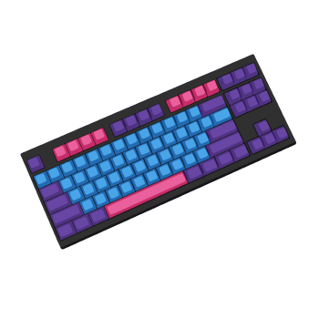

```zsh
> neofetch
```

 

```csharp
sreecha@github
-----------------

OS:         Arch Linux x64 
Shell:      ZSH
Pronouns:   He/Him
Nickname:   sreecha
Location:   Localhost
Languages:  Python, JS, Html, Css, Bash, MySQL
Learning:   Rust , TS
Hobbies:    Coding, Music, Sports
 
                    
```

<p align="left">
  &nbsp; &nbsp; &nbsp; &nbsp; &nbsp;&nbsp; &nbsp; &nbsp; &nbsp; &nbsp;&nbsp; &nbsp; &nbsp; &nbsp;
  
  
  
  
  
</p>

---
